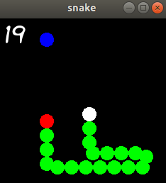
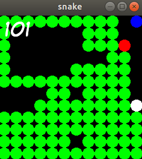

# snake

juego de la serpiente

activa o desactiva el movimiento automatico poniendo como comentario la linea 43 (serp.automatico())

modificar tamaño del terreno en datos.hpp apartado: casillas

En partida:
   - presionar tecla p para parar
   - presionar tecla c para continuar
   - flechas del teclado para moverte
   

librerias:
  SFML2
  
compilar:
  make

